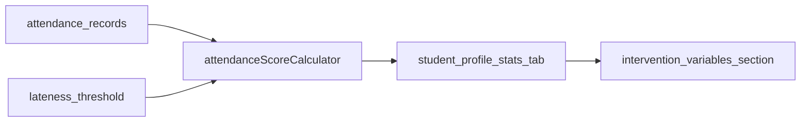

# 스탯 탭 분류 + 출석 점수 1단계

## 목표

- 학생 상세 페이지 `스탯`을 **비개입 변수 / 개입 가능 변수** 2축으로 정리.
- 출석 점수를 **개입 가능 변수**로 1단계 도입.
- 이번 단계는 **실시간 계산 + 표시 중심**으로 최소 구현하고, 총점/자동화 파이프라인은 후속 단계로 분리.

## 기준 문서 반영

- 구조 기준은 manager 문서와 동일한 분류 원칙을 따름.
  - [C:/Users/harry/Yggdrasill/docs/assessment/README.md](C:/Users/harry/Yggdrasill/docs/assessment/README.md)
  - [C:/Users/harry/Yggdrasill/docs/assessment/model.md](C:/Users/harry/Yggdrasill/docs/assessment/model.md)
  - [C:/Users/harry/Yggdrasill/docs/assessment/terms/non_intervention.md](C:/Users/harry/Yggdrasill/docs/assessment/terms/non_intervention.md)
  - [C:/Users/harry/Yggdrasill/docs/assessment/terms/intervention.md](C:/Users/harry/Yggdrasill/docs/assessment/terms/intervention.md)

## 구현 범위

### 1) 스탯 탭 섹션 구조화

- 대상: [C:/Users/harry/Yggdrasill/apps/yggdrasill/lib/screens/student/student_profile_page.dart](C:/Users/harry/Yggdrasill/apps/yggdrasill/lib/screens/student/student_profile_page.dart)
- 기존 등급 입력 블록 아래에 섹션 2개 추가:
  - `비개입 변수`
  - `개입 가능 변수`
- 현재 단계에서 출석 점수 카드는 `개입 가능 변수` 섹션에만 추가.

### 2) 출석 점수 계산기(앱 내부) 추가

- 대상:
  - [C:/Users/harry/Yggdrasill/apps/yggdrasill/lib/services/attendance_service.dart](C:/Users/harry/Yggdrasill/apps/yggdrasill/lib/services/attendance_service.dart)
  - [C:/Users/harry/Yggdrasill/apps/yggdrasill/lib/services/data_manager.dart](C:/Users/harry/Yggdrasill/apps/yggdrasill/lib/services/data_manager.dart)
- 학생별 출석 기록을 이용해 점수 계산 함수 추가(읽기 전용 API):
  - 예: `calculateAttendanceScore(studentId)`
- 초기 계산식(기본안) 적용:
  - 이벤트 점수: 출석 1.0, 지각 0.6, 결석 0.0
  - 시간감쇠: 반감기 28일
  - 비율 점수: `sum(w*score)/sum(w)`
  - 스무딩: prior 0.9, k=8
  - 최종 표시: 0~100 점
- 지각 판정은 기존 `lateness_threshold` 규칙을 재사용.

### 3) 스탯 탭 UI 카드 연결

- 대상: [C:/Users/harry/Yggdrasill/apps/yggdrasill/lib/screens/student/student_profile_page.dart](C:/Users/harry/Yggdrasill/apps/yggdrasill/lib/screens/student/student_profile_page.dart)
- 카드 표시 항목:
  - 출석 점수(메인)
  - 보조 정보(최근 가중 출석/지각/결석 기여치)
  - 기준 설명(최근일수 가중, 수업량/재원기간 편향 보정)
- 계산 실패/기록 부족 시 안내 문구 표시.

### 4) 1단계 비범위 명시

- 이번 단계에서 제외:
  - 총점 산출
  - DB에 출석 점수 snapshot 저장
  - 과제 완료/이벤트 트리거 기반 자동 반영 파이프라인
- 이 항목은 2단계 계획으로 분리.

### 5) 검증

- 학생 상세 `스탯` 탭에서 섹션 구조가 문서 철학과 일치하는지 확인.
- 서로 다른 수업량/재원기간 케이스에서 점수 편향이 줄어드는지 샘플 점검.
- 지각/결석의 과거 영향이 감쇠되는지 날짜를 바꿔 검증.
- 린트/빌드 에러 없이 카드 렌더링 확인.

## 데이터 흐름

