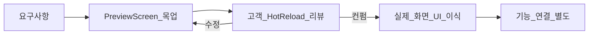

# Yggdrasill Design System

> UI/디자인 관련 작업 전 **반드시** 이 문서를 읽는다.  
> Cursor Rule: [`.cursor/rules/design-system.mdc`](../.cursor/rules/design-system.mdc)  
> 마지막 업데이트: 2026-05-29 | 담당: (고객 — 인터뷰 후 이름 기입)

---

## 0. 에이전트 필수 체크리스트

작업 시작 전 아래를 확인한다.

- [ ] 이 문서(`docs/design-system.md`) 전체를 읽었다
- [ ] 적용 대상 앱을 확인했다 (`yggdrasill` / `yggdrasill_manager`)
- [ ] §6 기준 화면(Golden Screens) 표를 확인했다
- [ ] **Preview 목업**으로만 UI를 작업한다 (고객 컨펌 전 프로덕션 `*_screen.dart` 수정 금지)
- [ ] 문서·기존 상수에 없는 **새 색상 / 폰트 / radius / spacing** 토큰을 만들지 않는다
- [ ] 기존 컴포넌트(§5) 재사용을 우선한다
- [ ] UI 변경과 기능(Provider, API, `onTap` 비즈니스 로직)을 분리한다
- [ ] 작업 완료 후 §10 변경 이력에 한 줄을 추가한다

---

## 1. 브랜드·UX 원칙 (고객 작성 — 인터뷰 후 채움)

아래 항목은 [§ 부록: 고객 인터뷰](#부록-고객-인터뷰-질문) 답변을 받은 뒤 채운다.

| 항목 | 내용 |
|------|------|
| 톤앤매너 | _(미작성)_ |
| 정보 밀도 | _(미작성 — 촘촘 / 보통 / 여유)_ |
| 주 사용자 / 사용 환경 | _(미작성 — 예: 학원 선생님, Windows 데스크톱)_ |
| 참고 앱·서비스 | _(미작성)_ |
| 피하고 싶은 느낌 | _(미작성)_ |
| 강조색 `#33A373` | _(미작성 — 브랜드 고정 / 추후 변경 가능)_ |
| 절대 하지 말 것 | _(미작성)_ |

---

## 2. 팔레트 (현재 코드 스냅샷 — 추후 교체 용이)

**원칙:** 지금은 **현 상태 유지**. 색은 이 표에 HEX를 기록해 두고, 변경 시 표 → 코드 상수 순으로 동기화한다.  
장기 목표: `lib/theme/` 또는 monorepo `packages/`로 일원화 (아직 미구현).

### 2.1 레거시 메인 셸 (`main.dart` ThemeData)

소스: [`apps/yggdrasill/lib/main.dart`](../apps/yggdrasill/lib/main.dart) (약 L1076–1122)

| 토큰명 | HEX | 용도 |
|--------|-----|------|
| `scaffoldBackground` | `#1F1F1F` | 메인 Scaffold / AppBar 배경 |
| `navRailIndicator` | `#0F467D` | NavigationRail 선택 인디케이터 |
| `fabPrimary` | `#1976D2` | FloatingActionButton |
| `tooltipBg` | `#1F1F1F` | Tooltip 배경 |
| `tooltipBorder` | `Colors.white24` | Tooltip 테두리 |
| `navIconSelected` | `#FFFFFF` | NavRail 선택 아이콘 (size 30) |
| `navIconUnselected` | `#FFFFFF` @ 70% | NavRail 비선택 아이콘 |

**레이아웃 (Theme):**

| 항목 | 값 |
|------|-----|
| AppBar `toolbarHeight` | 80 |
| NavRail `minWidth` | 84 |
| Material | 3 (`useMaterial3: true`) |

### 2.2 신형 다크 틸 (`dialog_tokens` / 패널·다이얼로그)

소스: [`apps/yggdrasill/lib/widgets/dialog_tokens.dart`](../apps/yggdrasill/lib/widgets/dialog_tokens.dart)

| 토큰명 (코드) | HEX | 용도 |
|---------------|-----|------|
| `kDlgBg` | `#0B1112` | 다이얼로그·패널 배경 |
| `kDlgPanelBg` | `#10171A` | 패널 내부 |
| `kDlgFieldBg` | `#15171C` | 입력 필드 배경 |
| `kDlgBorder` | `#223131` | 테두리 |
| `kDlgText` | `#EAF2F2` | 본문 텍스트 |
| `kDlgTextSub` | `#9FB3B3` | 보조 텍스트 |
| `kDlgAccent` | `#33A373` | 강조(초록) |
| `_chipSelected` | `#1B6B63` | 필터 칩 선택 |
| `_chipBg` | `#2A2A2A` | 필터 칩 비선택 배경 |
| `_chipText` | `#CDD5D5` | 필터 칩 비선택 텍스트 |

**동일 팔레트 — private 복제 (`right_side_sheet.dart`):**

| private 상수 | HEX | = dialog_tokens |
|--------------|-----|-----------------|
| `_rsBg` | `#0B1112` | `kDlgBg` |
| `_rsPanelBg` | `#10171A` | `kDlgPanelBg` |
| `_rsFieldBg` | `#15171C` | `kDlgFieldBg` |
| `_rsBorder` | `#223131` | `kDlgBorder` |
| `_rsText` | `#EAF2F2` | `kDlgText` |
| `_rsTextSub` | `#9FB3B3` | `kDlgTextSub` |
| `_rsAccent` | `#33A373` | `kDlgAccent` |

### 2.3 기타 반복 색상

| HEX | 용도 | 소스 |
|-----|------|------|
| `#151C21` | PillTabSelector 트랙 배경 | `pill_tab_selector.dart` |
| `#1B6B63` | PillTab / CustomTabBar 인디케이터 | `pill_tab_selector.dart`, `custom_tab_bar.dart` |
| `#7E8A8A` | PillTab 비선택 라벨 | `pill_tab_selector.dart` |
| `#2A2A2A` | SnackBar 배경 | `app_snackbar.dart` |
| `#0B1112` | CustomNavigationRail 배경, DarkPanelRoute | `navigation_rail.dart`, `dark_panel_route.dart` |
| `#223131` | CustomNavigationRail indicator | `navigation_rail.dart` |
| `#EAF2F2` | CustomNavigationRail 아이콘 | `navigation_rail.dart` |
| `#1976D2` | 업데이트 UI primary (배포) | `tools/RELEASE_GUIDE.md` |
| `#232326` | 업데이트 UI surface (배포) | `tools/RELEASE_GUIDE.md` |

### 2.4 화면 유형별 사용 규칙 (현 상태 유지)

| 화면 유형 | 사용 팔레트 | 비고 |
|-----------|-------------|------|
| 메인 셸 (NavRail, Scaffold, AppBar) | **레거시** §2.1 | `#1F1F1F` — 무단 변경 시 고객 승인 |
| 다이얼로그 / RightSideSheet / DarkPanel / 학습 패널 | **신형 티** §2.2 | `dialog_tokens` / `_rs*` 우선 |
| Pill·밑줄 탭 | §2.3 공통 | `#151C21`, `#1B6B63` |
| SnackBar | `#2A2A2A` | `showAppSnackBar` |
| 신형 Nav (`CustomNavigationRail`) | `#0B1112` 배경 | 레거시 Theme NavRail과 **공존** — 혼용 주의 |

**금지:** 레거시 Scaffold에 신형 틀 배경을 무단 적용하거나, 그 반대 (§9 참고).

### 2.5 동일 HEX 중복 정의 목록 (일원화 대비)

| HEX 세트 | 정의 위치 |
|----------|-----------|
| `kDlg*` 7색 | `dialog_tokens.dart` (canonical) |
| `_rs*` 7색 | `right_side_sheet.dart` |
| `_rs*` 복제 | `file_shortcut_tab.dart` (주석: private 접근 불가로 중복) |
| `_rsBg` 등 | `problem_bank_view.dart` (로컬 static) |

색상 변경 시 **위 파일들을 함께** 검색·동기화할 것.

### 2.6 색상 변경 시 절차

1. 이 문서 §2 표의 HEX 수정
2. `dialog_tokens.dart` 및 §2.5 목록의 중복 파일 동기화
3. Preview 목업에서 영향 화면 스모크 확인
4. 고객 승인 후 프로덕션 반영
5. §10 변경 이력 기록

---

## 3. 타이포그래피

소스: [`main.dart`](../apps/yggdrasill/lib/main.dart), [`pubspec.yaml`](../apps/yggdrasill/pubspec.yaml)

| 역할 | 폰트 패밀리 | Theme / 용도 |
|------|-------------|--------------|
| 본문·라벨 | `KakaoSmallSans` | `fontFamily` 기본, `body*`, `label*` |
| 제목·헤드라인 | `KakaoBigSans` | `display*`, `headline*`, `title*` |
| 문제은행·PDF | `HCRBatang`, `KoPubWorldBatangPro`, `ChosunNm` 등 | 도메인별 — UI 공통 규칙과 분리 |

**코드에서 자주 쓰는 실측 예시:**

| 용도 | fontSize | fontWeight | 출처 |
|------|----------|------------|------|
| 다이얼로그 섹션 제목 | 15 | w800 | `YggDialogSectionHeader` |
| 필터 칩 라벨 | 13 | w600 | `YggDialogFilterChip` |
| PillTab 라벨 | 17 (기본) | w600 | `PillTabSelector` |
| CustomTabBar 라벨 | (탭별) | — | `custom_tab_bar.dart` |

**금지:** UI 화면에 문서·Theme에 없는 새 폰트 패밀리 추가 (도메인 PDF/문제 렌더링 제외).

---

## 4. Spacing & Radius

**허용 spacing 스케일:** `4`, `8`, `10`, `12`, `16`, `24`  
임의 값(예: 13, 17, 19px padding)은 **새 UI에 사용 금지**. 기존 화면에 이미 있으면 Preview 리팩터 시 스케일로 맞출 것.

| 토큰 / 패턴 | 값 | 출처 |
|-------------|-----|------|
| 섹션 헤더 `padding` | `bottom: 10`, `top: 2` | `YggDialogSectionHeader` |
| 섹션 헤더 악센트 바 | `4×16`, radius `2` | `YggDialogSectionHeader` |
| 아이콘 간격 (헤더) | `10`, `8` | `YggDialogSectionHeader` |
| 필터 칩 padding | `horizontal: 14`, `vertical: 8` | `YggDialogFilterChip` |
| 필터 칩 height | `36` | `YggDialogFilterChip` |
| 필터 칩 radius | `18` | `YggDialogFilterChip` |
| PillTab 기본 크기 | `288×48`, padding `4` | `PillTabSelector` |
| PillTab radius | `height/2` (캡슐) | `PillTabSelector` |
| CustomTabBar 높이 | `48` | `CustomTabBar` |
| CustomTabBar 탭 너비·간격 | `120`, gap `21` | `CustomTabBar` |
| CustomTabBar 인디케이터 | `6` 높이, radius `3` | `CustomTabBar` |
| NavRail leading padding | `top: 6`, `bottom: 8` | `navigation_rail.dart` |
| Nav 아이콘 size | `26` (rail), `30` (Theme legacy) | `navigation_rail.dart`, `main.dart` |
| DarkPanel 전환 | `280ms` / `220ms` reverse | `dark_panel_route.dart` |
| 칩 애니메이션 | `160ms` | `YggDialogFilterChip` |
| PillTab 애니메이션 | `250ms`, `easeOutCubic` | `PillTabSelector` |

---

## 5. 컴포넌트 카탈로그 (재사용 우선)

경로 기준: `apps/yggdrasill/lib/widgets/` (unless noted)

| 컴포넌트 | 파일 | 언제 쓰나 |
|----------|------|-----------|
| `YggDialogSectionHeader` | `dialog_tokens.dart` | 다이얼로그 섹션 제목 |
| `YggDialogFilterChip` | `dialog_tokens.dart` | 다이얼로그 필터·토글 칩 |
| `PillTabSelector` | `pill_tab_selector.dart` | Pill + 슬라이딩 인디케이터 탭 |
| `CustomTabBar` | `custom_tab_bar.dart` | 밑줄 인디케이터 탭 |
| `CustomNavigationRail` | `navigation_rail.dart` | 신형 틀 좌측 네비 (`#0B1112`) |
| `DarkPanelRoute` | `dark_panel_route.dart` | 풀스크린 다크 패널 전환 |
| `showAppSnackBar` | `app_snackbar.dart` | 짧은 피드백 메시지 |
| `CustomFormDropdown` | `custom_form_dropdown.dart` | 폼 드롭다운 |
| `ClassCard`, `StudentCard`, `TeacherCard` | `class_card.dart` 등 | 엔티티 카드 |
| `MainFab` / `MainFabAlternative` | `main_fab.dart` 등 | FAB 패턴 |
| RightSideSheet 계열 | `right_side_sheet/` | 우측 시트·채점·메모 |
| PDF 다이얼로그 | `pdf/*.dart` | 교재·숙제 뷰어 |

**금지:** 위와 **동일 역할**의 새 위젯을 임의 생성. 필요 시 기존 위젯 확장 또는 고객 승인.

**아이콘:** `material_symbols_icons` (`Symbols.*`) — Material Icons와 혼용 시 기존 화면 톤 유지.

---

## 6. 기준 화면 (Golden Screens) — 고객이 채움

디자인·리팩터 시 **이 화면들의 밀도·색·컴포넌트 사용을 우선 복제**한다.

| 화면명 | 파일 경로 | 왜 기준인가 | 스크린샷 |
|--------|-----------|-------------|----------|
| _(비어 있음)_ | | | |
| _(비어 있음)_ | | | |
| _(비어 있음)_ | | | |

**손대면 안 되는 화면 (레거시 유지):**

| 화면명 | 파일 경로 | 사유 |
|--------|-----------|------|
| _(비어 있음)_ | | |

---

## 7. Preview 목업 워크플로 (필수)



### 규칙

1. UI 변경은 **`lib/screens/design_preview/`** 또는 **`*_preview_screen.dart`** 에서 먼저 수행한다.
2. **mock 데이터만** 사용한다. Provider / API / 비즈니스 `onTap` 연결 금지.
3. **고객 컨펌 전** 프로덕션 `*_screen.dart` 및 기능 로직 파일 수정 금지.
4. 컨펌 후: **UI 위젯 트리만** 이식하고, diff는 최소화한다.
5. 기능 연결(상태, API)은 **별도 작업**으로 분리한다.

### Preview 실행 (완전 분리)

Preview는 본앱과 같은 `build/windows/.../Debug` 산출물을 공유하지 않도록
**별도 Flutter 앱**에서 실행한다.

```powershell
cd apps\yggdrasill_design_preview
flutter run -d windows
```

본앱 실행과 Preview 실행은 서로 다른 Flutter 프로젝트이므로 Windows DLL 잠금 충돌을 피한다.

시안 개수: 한 Preview 화면에 **최대 2~3안(A/B/C)**. 그 이상은 통일성 저하.

### 에이전트 프롬프트 템플릿

```text
docs/design-system.md를 먼저 읽고 준수해.
Preview 목업만 만들고, 프로덕션 *_screen.dart는 건드리지 마.
새 색상/폰트/spacing/radius를 만들지 말고 문서 §2~§4와 기존 위젯(§5)만 사용해.
기능 로직(Provider, API, onTap)은 연결하지 마.
```

### Preview 폴더 구조 (앱·M5 분리)

**학습앱** — `apps/yggdrasill/lib/screens/design_preview/`

```
design_preview/
  design_preview_hub_screen.dart
  yggdrasill/                    # 학습앱 화면 (설정 등)
    settings/
      settings_preview_screen.dart
  m5/                            # M5 기기 UI (바인딩 히스토리 등)
    README.md
```

**매니저앱** — `apps/yggdrasill_manager/lib/screens/design_preview/`

```
design_preview/
  design_preview_hub_screen.dart
  yggdrasill_manager/
    settings/
      management_settings_preview_screen.dart
```

**별도 창 (권장 — 실사용 디버그 앱과 동시 실행):**

| 터미널 | 명령 |
|--------|------|
| 본앱 | `cd apps\yggdrasill; flutter run -d windows` |
| 디자인 Preview | `cd apps\yggdrasill_design_preview; flutter run -d windows` |

Preview 루트에서 **학습앱 Preview** 또는 **매니저앱 Preview**를 선택한다.

---

## 8. 앱별 차이

| 항목 | yggdrasill | yggdrasill_manager |
|------|------------|-------------------|
| Scaffold 배경 | `#1F1F1F` + 신형 틀 혼용 | `#1F1F1F` |
| ColorScheme seed | (Theme 직접 색) | `#33A373` |
| 폰트 | KakaoSmallSans / KakaoBigSans | 동일 |
| dialog_tokens | 사용 | (화면별 확인) |
| 공통 규칙 | §2~§7 | §2~§7 + 본 표 |

매니저 앱 전용 예외는 추후 §8에 추가한다.

---

## 9. 안티패턴 (하지 말 것)

- 스크린샷·Figma만 보고 레이아웃 **전면 재설계** (기능 맥락 무시)
- 문서·`dialog_tokens`에 없는 `Color(0xFF...)` **신규 하드코딩**
- 레거시 Scaffold ↔ 신형 틀 팔레트 **무단 교차 적용**
- UI 작업 PR에 Provider / API / 대규모 `onPressed` 로직 변경 포함
- 동일 역할 위젯 중복 생성 (§5 무시)
- 컨펌 없이 프로덕션 화면 직접 수정
- spacing 스케일(§4) 밖 임의 값 남발

---

## 10. 변경 이력

| 날짜 | 변경 | 승인자 |
|------|------|--------|
| 2026-05-29 | 초안 생성 (코드 스냅샷, Preview 워크플로, Cursor Rule 연동) | — |
| 2026-05-29 | Preview 폴더 분리 (yggdrasill / manager / m5), 설정 목업·kDebugMode 라우트 | — |
| 2026-05-30 | 앱 내부 Preview 진입점 실험 (이후 완전 분리 방식으로 대체) | — |
| 2026-05-31 | `apps/yggdrasill_design_preview` 완전 분리 Preview 앱 생성 | — |

---

## 부록: 고객 인터뷰 질문

§1·§6을 채우기 위한 질문. 답변을 주시면 본문에 반영한다.

### A. 브랜드·느낌

1. 앱을 한 문장으로 설명하면?
2. 참고하고 싶은 앱/서비스 1~3개?
3. 피하고 싶은 느낌?
4. 강조색 `#33A373` — 브랜드 고정 vs 추후 변경 가능?

### B. 정보 밀도·레이아웃

5. 정보 많이 vs 여백 많이?
6. 카드/리스트 행 높이 선호 (촘촘 vs 큰 터치 영역)?
7. 다이얼로그 최대 너비·패딩 선호?

### C. 기준 화면

8. "제일 잘 됐다"는 화면 3~5개 (파일 경로)?
9. "손대면 안 된다" 화면?

### D. Preview·승인

10. Preview 진입 방식: (a) 설정 숨김 (b) `kDebugMode` (c) `--dart-define`
11. 한 번에 시안 몇 개까지? (권장 2~3)

### E. 접근성·플랫폼

12. 최소 글자 크기 / 고대비 요구?
13. Windows만 vs 태블릿/웹 추후 고려?
